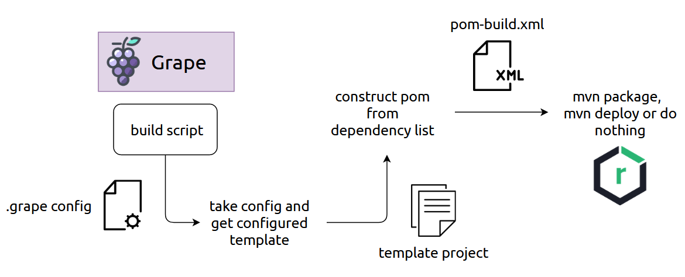

# grape

> Dependency bundling and service management system


# Requirements

- It should work for python2 as well, but python3 is recommended
- `pip install requirements.txt`
- Maven version >=3.3.9

# Building process



The building script (`build.py`) takes in a path to a config file and a path to a template project. The full usage looks like this:

```
python build.py --template [path/to/template] path/to/config
```

The config file is a mixture of `.ini` and `.csv`. More details in [the next chapter](#grape-file).

# .grape File

Each dependency bundle is represented with one single **.grape** file. This file could look like this:

```
[Config]
groupId=dev.volix.lib.grape
artifactId=grape-lobby
version=0.1.0
stage=none

[Dependencies]
# tv.rewinside;frames;0.1.0
tv.rewinside;java-config;0.7.2
dev.volix.odyssey;inv-system;0.6.4
dev.volix.odyssey;region-system;[0.0,)
```

Comments can be made with `#` in front of the line.

# Service Management

If you want to use service management part of Grape, you can just add following dependency:

```xml
<dependency>
  <groupId>dev.volix.lib</groupId>
  <artifactId>grape-api</artifactId>
  <version>[0.0,)</version>
</dependency>
```

And then start registering your own `Service` with:
 
```java
YourService service = new YourService();
Grape.getInstance().register(YourService.class, service);
```

After that other systems can access registered services via:

```java
instance.get(YourService.class).thenAccept(new Consumer<YourService>() {
    @Override
    public void accept(YourService service) {
        // do something
    }
});
```
